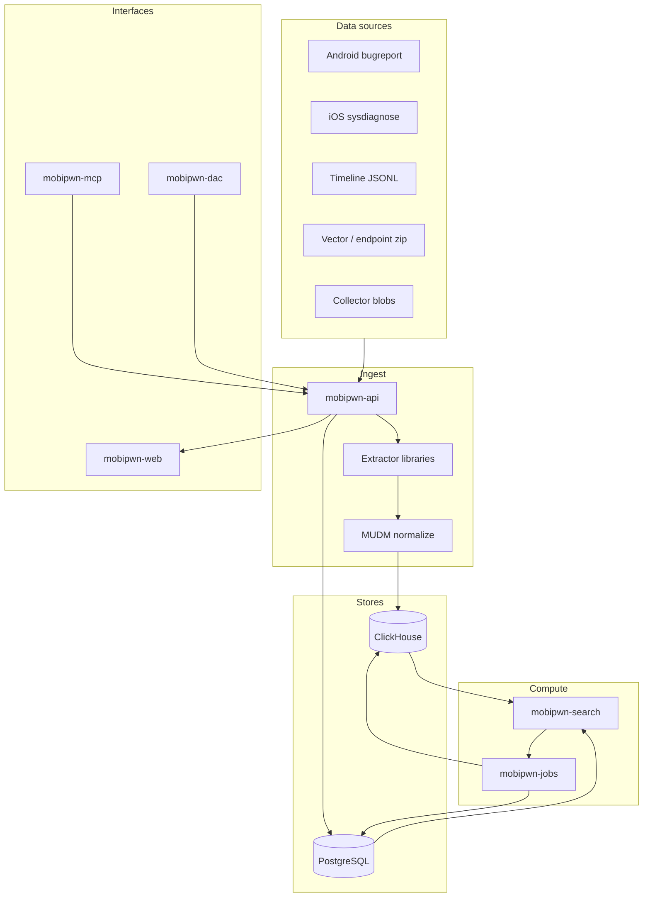
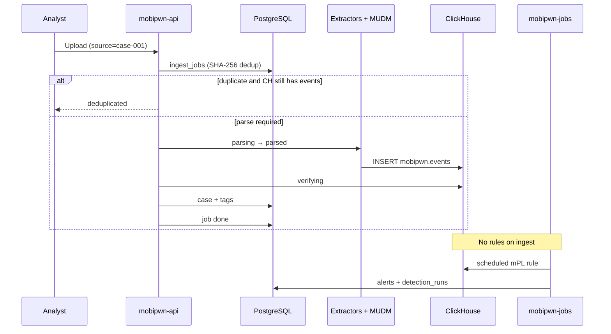

# MobiPwn platform architecture

Technical overview of how MobiPwn works — processes, data flow, stores, crates, and the full life of ingested data.

**In the UI:** sidebar → **How it works** (`/guide/architecture`).

Related: [MPL_LANGUAGE.md](./MPL_LANGUAGE.md), [ANDROID_SEARCH.md](./ANDROID_SEARCH.md), [MCP.md](./MCP.md).

---

## Index & database

The searchable event **index** and **metadata database** follow the [nano](https://github.com/nano-rs/nano) dual-store layout: **ClickHouse** for hot events (and enrichment dictionaries), **PostgreSQL** for rules, alerts, cases, ingest jobs, and auth.

---

## System overview



| Layer | Technology | Role |
|-------|------------|------|
| Hot analytics | ClickHouse | Events, detection signals, enrichment dicts, field prevalence |
| Metadata | PostgreSQL | Rules, alerts, cases, ingest jobs, marketplace, users |
| Compute | Rust workspace | Ingest, mPL → SQL, API, scheduled jobs |
| UI | React (Vite) | Search, Detections, Alerts, Cases, Collector, Marketplace |

---

## Deploy modes

| Mode | Command | What runs where |
|------|---------|-----------------|
| **Container stack** | `./compose.sh up` | Postgres, ClickHouse, API, jobs, nginx web (Docker or Podman) |
| **Host dev** | `./dev.sh` | DBs in Docker; API, jobs, Vite on host (hot reload) |

Both modes share `.env`, `migrations/001_schema.sql`, `clickhouse/init.sql`, and the data lifecycle below.

---

## Life of ingested data

**Critical:** ingest **does not** run detection rules. Rules execute on **per-rule cron** (`mobipwn-jobs`) or API **Run now**.



### Ingest stages (HTTP archive upload)

Tracked in Postgres `ingest_jobs.stage` / `stage_detail`:

| Stage | Meaning |
|-------|---------|
| `parsing` | Running bugreport or sysdiagnose extractors |
| `parsed` | MUDM events ready; parser summary in `stage_detail` |
| `inserting` | Batched ClickHouse insert (progress in `progress_json`) |
| `verifying` | `count()` by `source` matches inserted rows |
| `syncing` | Case row + tags linked to `source` |
| *(done)* | Job `status=done`; temp archive removed |

### Step-by-step reference

| # | Step | Component | Detail |
|---|------|-----------|--------|
| 1 | **Intake** | API, CLI, `/collect` | Formats: bugreport `.zip`/`.txt`, sysdiagnose `.tar.gz`, JSONL, endpoint zip, collector blobs. `source=` is the investigation label. |
| 2 | **Dedup** | `ingest_jobs` | Unique `(source, file_hash)`. Skip if prior job `done` **and** ClickHouse still has rows for `source`. Re-ingest after `./dev.sh --clean` when CH is empty but Postgres job remains. |
| 3 | **Blob store** | `collect_blobs` | Optional store-only upload (`analyzed=false`) — parse deferred until re-ingest from blob library. |
| 4 | **Parse** | `mobipwn-ingest` + [bugreport-extractor-library](https://github.com/ismyphonepwned/bugreport-extractor-library) / [sysdiagnose-extractor-library](https://github.com/ismyphonepwned/sysdiagnose-extractor-library) | Android: dumpstate parsers, optional Rusty Magpie. iOS: archive extraction + flatten. iOS **logarchive** unified-log decode is opt-in (`logarchive-decode` / `./dev.sh --logarchive-decode`) — see [LOGARCHIVE_DECODE.md](./LOGARCHIVE_DECODE.md). |
| 5 | **Normalize** | `mobipwn-core` MUDM | Promoted columns + `ext` JSON; `apply_bugreport_parser_fields` per parser. |
| 6 | **Index** | ClickHouse | `mobipwn.events` MergeTree, daily partitions. |
| 7 | **Case link** | Postgres `cases` | `ensure_for_ingest_source`; optional `user=` query param and ingest tags. |
| 8 | **Hunt** | `mobipwn-search` | Analyst mPL queries; admission time bounds; `lookup` enrichments at query time. |
| 9 | **Detect** | `mobipwn-jobs` / API | `execute_detection_rule` → alert upsert (dedup by rule + facets). Staging lifecycle: manual only. |
| 10 | **Enrich** | Marketplace + jobs | Provider cron → ClickHouse enrichment tables → dictionaries (raw events unchanged). |
| 11 | **Realtime** | ClickHouse MVs | Filter-only rules → `detection_signals` on insert; jobs promote to alerts ~every 2 min. |
| 12 | **Triage** | `mobipwn-web` | Alerts, cases, inbox workflow; search links from alert facets. |

### What does *not* happen on ingest

- Detection rules (scheduled or realtime MV evaluation on new rows is separate)
- Marketplace enrichment sync (provider cron in jobs)
- Field prevalence rollup
- Alert creation

---

## Runtime processes

| Process | Bind (typical) | Purpose |
|---------|----------------|---------|
| mobipwn-api | `:3000` / `:5174` dev | REST, Swagger, ingest, search, rules, alerts, collect |
| mobipwn-jobs | — | Schedulers + housekeeping loop |
| mobipwn-web | `:5173` dev / `:8080` compose | React SPA |
| mobipwn-search | `:3002` | Optional standalone (API embeds same libs) |
| PostgreSQL | `:5432` | Metadata (`migrations/001_schema.sql`) |
| ClickHouse | `:8123` | Events (`clickhouse/init.sql` + `scripts/ch-migrate.sh`) |

```bash
./compose.sh up    # full container stack
./dev.sh           # host dev (DBs only in Docker)
./dev.sh --logarchive-decode   # host dev + iOS unified-log decode (see LOGARCHIVE_DECODE.md)
```

---

## Workspace crates

| Crate | Type | Owns |
|-------|------|------|
| **mobipwn-core** | Library | MUDM, DualPool, alerts/cases/dashboards, Sigma→mPL, enrichment sync, prevalence, CH helpers, settings |
| **mobipwn-search** | Lib + bin | mPL parser, SQL gen, admission, `run_search`, **`execute_detection_rule`** |
| **mobipwn-ingest** | Lib + bin | Extractor integration, JSONL, CH batch insert, `import-rules`, CLI |
| **mobipwn-api** | Binary | Axum REST, OpenAPI, auth, ingest jobs, collect blobs, LLM/MCP integration |
| **mobipwn-jobs** | Binary | Detection cron, enrichment cron, prevalence, realtime signals, MV sync |
| **mobipwn-dac** | Binary | GitOps deploy rules/queries from `examples/mobipwn-queries` |
| **mobipwn-mcp** | Binary | MCP server for external LLM agents ([MCP.md](./MCP.md)) |
| **mobipwn-web** | Frontend | React UI (not in Cargo workspace) |
| **mobipwn-webadb** | WASM (excluded) | WebUSB ADB + optional in-browser bugreport analysis |
| **mobi-android-collector** | WASM (excluded) | Rusty Magpie collector artifacts |

---

## MUDM & ClickHouse

Events in `mobipwn.events`: `source`, `platform`, `parser`, `bundle_id`, `process_name`, network fields, `message`, `ext` (JSON).

| Object | Purpose |
|--------|---------|
| `mobipwn.events` | Primary event store (MergeTree, daily partitions) |
| `mobipwn.detection_signals` | Realtime rule matches + builtin high-severity MV output |
| `mobipwn.field_prevalence_agg` | Rarity / noise sidebar in Search |
| `*_enrichment_dict` | `lookup` geo, VT, Play Store at query time |

---

## PostgreSQL

System of record: detection rules + versions + runs, alerts + timeline, cases, search history, dashboards, marketplace providers, ingest jobs, collect blobs, users/settings.

---

## Search & detection

- mPL → ClickHouse SQL (`mobipwn-search/src/mpl`, `sql_gen.rs`)
- Admission: time bounds, row/join limits ([MPL_LANGUAGE.md](./MPL_LANGUAGE.md))
- **`execute_detection_rule`** shared by API **Run now** and jobs

| Lifecycle | Scheduled cron | Alerts |
|-----------|----------------|--------|
| staging | No | Run now only |
| live / alerting | Yes (per-rule cron) | Yes |

**Realtime rules:** filter-only mPL → materialized view on insert → `detection_signals`.

---

## Jobs process (`mobipwn-jobs`)

Two layers:

1. **Per-rule / per-provider cron** (`tokio-cron-scheduler`) — detection rules and marketplace providers each get a cron from DB; reconciled every **2 minutes**.
2. **60s main loop** — housekeeping:

| Interval | Task |
|----------|------|
| Every 60s | Sleep tick; scheduler sync every 2 ticks |
| Every 2 ticks (~2 min) | Reconcile detection + enrichment crons; process realtime signals → alerts |
| Every 10 ticks (~10 min) | Sync realtime rule materialized views |
| Every 15 ticks (~15 min) | Field prevalence rollup |

Logs: `.dev/jobs.log` (host dev) or `./compose.sh logs mobipwn-jobs`.

---

## API & UI

- Swagger: `/swagger-ui`
- Ingest: `POST /v1/ingest/bugreport`, `/sysdiagnose`, `/jsonl`
- Search: `POST /v1/search/run`
- Rules: CRUD + `validate` + `run`
- Collect: blob store, device pull config, public `/collect`

Web dev proxies `/api` → API; compose nginx does the same on `:8080`.

---

## Configuration

See `.env.example` — datastore URLs, search limits, `MOBIPWN_JOBS_ENABLED`, `MOBIPWN_REQUIRE_AUTH`, proxy vars for `./compose.sh` builds.

Full operator reference: [README.md](../README.md).
