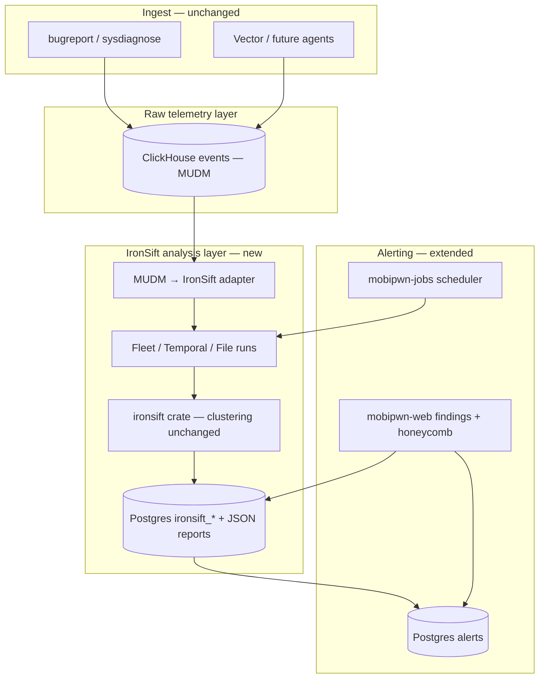

# IronSift × mobipwn — integration plan

This document describes how to integrate [IronSift](https://github.com/ping2A/IronSift) into mobipwn: keep **all endpoint telemetry in MUDM/ClickHouse** (process, network, etc., as today), and add an **IronSift analysis layer** that runs clustering/baseline logic unchanged, then **surfaces findings as mobipwn alerts** (and optionally cases/entities).

**IronSift summary:** Rust-based fleet anomaly detection using unsupervised ML (TF-IDF + DBSCAN on process/file profiles). Modes: **fleet** (many machines), **temporal** (one machine, snapshot diff), **file** (fleet file-access baselines). License: Apache-2.0 (compatible with mobipwn MIT).

**mobipwn differentiators (keep):** MUDM platforms (`android`, `ios`, **`endpoint`**), bugreport/sysdiagnose extractors, Vector/agent ingest, mPL hunt queries, Sigma-style detection rules — IronSift complements these; it does not replace them.

**Platform model:** Endpoint telemetry uses MUDM `platform="endpoint"` (Vector ingest accepts `vector` as an alias; events are stored as `endpoint`). IronSift runs **only** on endpoint-scoped ClickHouse data — not on mobile bugreport/sysdiagnose ingests.

---

## Goals

1. **Raw logs unchanged** — ingest, ClickHouse `events`, and mPL search over `parser`, `process_name`, `dest_ip`, etc. stay as they are.
2. **IronSift logic unchanged** — use the `ironsift` library (`build_profiles`, `analyze_fleet`, `compare_temporal`, …); do not reimplement DBSCAN/clustering in mobipwn.
3. **Findings → alerts** — IronSift results trigger mobipwn alerts with rich context (reasons, severity, machine/device, run id), preserving analyst triage semantics (false positive / malicious / unset).
4. **Operational fit** — runs scheduled in `mobipwn-jobs`, configurable scopes (fleet, case, single device), auditable like case audit events.

---

## Architecture (two layers, one product)



**Principle:** IronSift never replaces ingest. It **reads** from ClickHouse (or a materialized export), runs its own algorithms, and **writes structured findings** that mobipwn turns into alerts. Raw hunt queries on `parser=Process`, `dest_ip`, etc. remain the primary investigation path.

---

## Integration style

| Option | Verdict |
|--------|---------|
| **A. Rust library dependency** (`ironsift` crate in workspace) | **Preferred** — preserves DBSCAN/clustering/triage logic in-process, no duplicate SQLite platform DB |
| B. Sidecar `ironsift-server` | Good for spike only; duplicates dataset storage and splits auth/UI |
| C. CLI subprocess | Avoid — harder to operate, worse observability |

### Recommended approach

- Add `ironsift` as a **path or git dependency** in the workspace.
- New crate: **`mobipwn-ironsift`** (or `mobipwn-core/src/ironsift/`) containing:
  - MUDM adapters
  - Run orchestration
  - Alert bridge
  - Config (`DetectionConfig` + mobipwn-specific scopes)
- **Do not** fork IronSift algorithms in mobipwn; only add adapters and glue.
- **Do not** use IronSift’s standalone SQLite platform DB (`.ironsift-platform/events.db`) in production mobipwn — use the library only.

---

## Identity & scoping model

IronSift’s `machine_id` must map cleanly to mobipwn investigations:

| mobipwn field | IronSift `machine_id` | Use |
|---------------|------------------------|-----|
| `device_id` | primary | One physical device |
| `source` (ingest label) | cohort tag / scope filter | One ingest source ≈ one device collection, not “fleet” by itself |
| `platform` + tags | run filters | Android vs iOS cohorts |

### Run scopes (configurable per job/UI)

| Scope | IronSift mode | When to use |
|-------|---------------|-------------|
| **Fleet** | `analyze_fleet` | ≥3 devices in cohort (org, platform, or open cases) |
| **Case-scoped fleet** | `analyze_fleet` | Devices linked to a case’s `ingest_source` or case tags |
| **Temporal** | `compare_temporal` | One `device_id`, baseline vs current snapshot |
| **File fleet** | `analyze_files_fleet` | When file-access rows exist in MUDM (later phase) |

---

## MUDM → IronSift adapters

### Process mode (fleet + temporal)

**ClickHouse source query (example):**

```sql
SELECT *
FROM mobipwn.events
WHERE parser IN ('Process', 'process')
  AND process_name != ''
  AND timestamp >= now() - INTERVAL 7 DAY
```

**Field mapping:**

| MUDM | IronSift |
|------|----------|
| `device_id` | `machine_id` |
| `process_id` | `pid` |
| `ext.ppid` (add if missing) | `ppid` |
| `process_name` / `ext.cmdline` | `name`, `path`, `args` |
| `user` (numeric) | `uid` |
| `timestamp` | `timestamp` |

**Gap work:** Ensure bugreport Process timeline exposes **parent PID, cmdline, and path** into MUDM `ext` where available. IronSift parent resolution depends on PID graph quality.

### Network mode (temporal initially)

**Source:** `parser IN ('Network', 'network')` with `dest_ip`, `src_ip`, ports in `ext`.

**Map to `RawConnectionEntry`** for `compare_temporal` (new IPs between snapshots).

Fleet clustering on connections is **not** in core IronSift today — use temporal diff first; optional future extension.

### File mode (optional phase)

**Source:** file-related parsers (Crash tombstones, package paths, future file inventory).

**Map to `RawFileEntry`** when path, mtime, owner exist in timeline JSON.

Mobile file inventory is sparser than osquery server logs; treat file mode as **best-effort** until extractors emit richer file rows.

---

## New module: `mobipwn-ironsift`

### Responsibilities

1. **Extract** — ClickHouse SQL → IronSift input structs (streaming batches)
2. **Run** — `build_profiles` + `analyze_fleet` / `analyze_files_fleet` / `compare_temporal` with `DetectionConfig`
3. **Persist** — Store run metadata + full forensic JSON
4. **Alert** — Translate findings → mobipwn alerts
5. **Audit** — Optional ClickHouse events: `source_type=audit source=ironsift` (parallel to case audit)

### Postgres schema (new migration)

```sql
-- Conceptual; exact columns TBD during implementation

ironsift_runs (
  id UUID PRIMARY KEY,
  scope TEXT NOT NULL,           -- fleet | case | device
  mode TEXT NOT NULL,            -- fleet | temporal | file
  config_json JSONB NOT NULL,
  started_at TIMESTAMPTZ,
  finished_at TIMESTAMPTZ,
  fleet_size INT,
  anomaly_count INT,
  status TEXT NOT NULL,
  error TEXT
);

ironsift_findings (
  id UUID PRIMARY KEY,
  run_id UUID REFERENCES ironsift_runs(id),
  machine_id TEXT NOT NULL,
  severity TEXT NOT NULL,
  score DOUBLE PRECISION,
  distance_score DOUBLE PRECISION,
  detector TEXT NOT NULL,        -- ironsift-process, ironsift-temporal, ...
  reasons TEXT[] NOT NULL,
  cluster_id TEXT,
  raw_json JSONB NOT NULL
);

ironsift_triage (
  run_id UUID,
  finding_id UUID,
  verdict TEXT NOT NULL,         -- unset | false_positive | malicious
  actor_id UUID,
  updated_at TIMESTAMPTZ
);

ironsift_run_devices (
  run_id UUID,
  device_id TEXT,
  source TEXT,
  case_id UUID
);
```

Store the **full IronSift JSON report** in `raw_json` for incident response replay.

### Configuration

- Platform default: merge `ironsift_config.json` with env (`MOBIPWN_IRONSIFT_*`)
- Per-run overrides: scope, time window, `dbscan_tolerance`, cohort tags
- Settings UI (admin): sensitivity presets (strict / balanced / loose)

Key IronSift config keys (from upstream):

| Parameter | Effect |
|-----------|--------|
| `dbscan_tolerance` | Detection sensitivity (lower = stricter) |
| `minority_cluster_ratio` | Botnet / small-cluster threshold |
| `entropy_threshold` | Obfuscation detection |
| `file_recent_mtime.*` | File mode mtime heuristics |

---

## Alert bridge (keep IronSift semantics)

**Do not** flatten findings into generic mPL rules. Use dedicated system rules and rich alert context.

### System detection rules

Create **immutable system rules** (similar to marketplace providers):

| Rule id (conceptual) | Mode |
|----------------------|------|
| `ironsift-fleet-anomaly` | Fleet DBSCAN outliers / minority clusters |
| `ironsift-temporal-new-process` | Temporal diff: new processes |
| `ironsift-temporal-new-connection` | Temporal diff: new IPs |
| `ironsift-file-fleet` | File fleet (later) |

`detection_mode = scheduled` + cron, or triggered post-ingest.

### Alert mapping

Each **actionable finding** (host + detector + primary reason) → one alert:

| IronSift | mobipwn alert |
|----------|---------------|
| severity / effective score | `severity` |
| `machine_id` | facet `device_id` |
| top reason string | `title` + dedup facet |
| suspicious processes, cluster, distance | `context` JSON |
| `run_id` | `context.ironsift_run_id` |

**Dedup key:** `hash(run_scope, machine_id, detector, normalized_reason)` — aligned with IronSift’s `(detector, reason)` triage memory.

**Upsert:** Repeat run updates `last_seen`, `event_count`; severity can rise if score increases.

### Triage sync

Port IronSift platform triage behavior:

- Alert drawer: false positive / malicious / unset
- Write to `ironsift_triage` **and** alert tags/status
- **Fleet reason memory:** If a `(detector, reason)` was marked FP on a prior run, pre-fill triage on new runs for the same pattern (only unset slots; never overwrite explicit analyst choices)

### What does *not* become alerts

- Context-only lines (e.g. “Process row: …”)
- CLEAN hosts in honeycomb
- Findings below configurable `min_score` threshold

---

## When analysis runs

| Trigger | Mode | Notes |
|---------|------|-------|
| **Scheduled job** (daily) | Fleet | All devices or per-tenant cohort |
| **Post-ingest hook** | Temporal | Baseline = previous ingest for same `source`; current = new ingest |
| **Manual API/UI** | Any | “Run IronSift on this case” |
| **Case backlog** | Fleet scoped | Only devices in open cases |

Implement in **`mobipwn-jobs`** first; optional lightweight trigger in API after ingest completes.

**Temporal baseline:** Reuse ingest job timestamps or persist “last successful fleet profile” snapshot in Postgres.

---

## API & UI

### API (new routes under `/v1/ironsift/`)

| Method | Path | Purpose |
|--------|------|---------|
| `POST` | `/runs` | Start run (scope, mode, config) |
| `GET` | `/runs` | List runs |
| `GET` | `/runs/:id` | Run detail + summary |
| `GET` | `/runs/:id/findings` | Findings table (triage-aware effective scores) |
| `GET` | `/runs/:id/honeycomb` | Fleet grid data |
| `PUT` | `/runs/:id/triage` | Save analyst verdicts |
| `GET` | `/config` | Default `DetectionConfig` |
| `PUT` | `/config` | Update defaults (admin) |

### UI pages

1. **IronSift / Fleet** — run launcher, honeycomb, findings table (IronSift UX patterns, mobipwn styling)
2. **Case detail** — “Run temporal diff” + link findings to case alerts
3. **Alerts inbox** — “IronSift” badge + expandable reasons / risk factors
4. **Search** — optional CH mirror: `source_type=ironsift` for SOC dashboards

**Skip** embedding IronSift’s full web UI (`ironsift-server`); reimplement minimal panels in React (consistent with Case detail, Alerts, Health).

---

## ClickHouse optional enrichment

Primary storage for runs/findings: **Postgres**. Optionally mirror summary events to ClickHouse for SOC dashboards:

```
source_type = ironsift
source = fleet | temporal | file
action = anomaly_detected
ext: { run_id, machine_id, detector, score, reasons[] }
```

Enables MTTR-style queries alongside case audit events (`source_type=audit source=case`).

Example mPL:

```
source_type=ironsift action=anomaly_detected severity=high
| stats count by machine_id, detector
```

---

## Phased delivery

### Phase 0 — Spike (1 week)

- [ ] Add `ironsift` dependency; prove: export one `source` from ClickHouse → adapter → `analyze_fleet`
- [ ] Document field coverage (% rows with pid, ppid, path, cmdline)
- [ ] Decide **temporal vs fleet** as first production ship

### Phase 1 — Library + adapter (2 weeks)

- [ ] `mobipwn-ironsift` crate
- [ ] ClickHouse extractors for Process (+ Network for temporal)
- [ ] Postgres migration + run persistence
- [ ] Unit tests: synthetic fleet (3 devices, 1 outlier)

### Phase 2 — Jobs + alerts (2 weeks)

- [ ] Scheduled fleet job in `mobipwn-jobs`
- [ ] Post-ingest temporal diff for same `source`
- [ ] System rules + alert upsert + rich `AlertContext`
- [ ] Case audit hooks: `ironsift_run_started`, `finding_created`

### Phase 3 — UI + triage (2 weeks)

- [ ] Runs list, findings table, honeycomb component
- [ ] Triage + reason memory
- [ ] Case detail integration

### Phase 4 — File mode + hardening (optional)

- [ ] File adapter when extractor coverage sufficient
- [ ] Config UI, sensitivity presets
- [ ] Performance: batch extract, run size limits
- [ ] README + sample mPL queries

### Phase 5 — Future (out of initial scope)

- [ ] AnoMark / Sigma-zero from IronSift platform (optional second detector)
- [ ] Real-time endpoint agents (Vector → MUDM → IronSift)
- [ ] Cross-case fleet baselines (“all Android devices in org”)

---

## Recommended first milestone

**Temporal diff on ingest** for a single investigation (`source` = one device):

- Smallest scope, highest value for mobile (“what changed since last collection?”)
- Validates MUDM adapter without requiring a large fleet
- Uses `compare_temporal` for new processes and new IP connections

---

## Risks & mitigations

| Risk | Mitigation |
|------|------------|
| Sparse mobile process logs vs server osquery | Lead with **temporal mode** per device; fleet only when ≥3 devices in cohort |
| Missing PPID/parent in bugreport | Enrich extractors; fallback parent=`unknown`; document lower confidence |
| Alert noise | `min_score`, triage memory, existing suppressions table |
| Duplicate storage with IronSift SQLite platform | Library-only integration |
| Two detection paradigms (Sigma/mPL vs ML) | Clear UI labeling; IronSift alerts use dedicated `rule_id`s |

---

## Success criteria

1. Ingest unchanged — all process/network/etc. still searchable in mPL.
2. IronSift fleet run on ≥3 devices produces outliers consistent with standalone IronSift on equivalent JSONL.
3. Temporal run after re-ingest flags **new processes** and **new IPs** on one device.
4. Findings appear in **Alerts** with reasons, severity, and pivot to raw MUDM events.
5. Analyst can mark FP/malicious; repeat runs respect triage memory.
6. Zero warnings on build; jobs idempotent; runs auditable.

---

## References

- [IronSift GitHub](https://github.com/ping2A/IronSift)
- [IronSift GUIDE.md](https://github.com/ping2A/IronSift/blob/main/GUIDE.md) — API usage, fleet/temporal/file modes
- mobipwn: detection/alerts/jobs baseline (Rules, Alerts, `mobipwn-jobs`)
- mobipwn: `docs/BUGREPORT_PARSER_FIELDS.md` — Process/Network field promotion into MUDM
